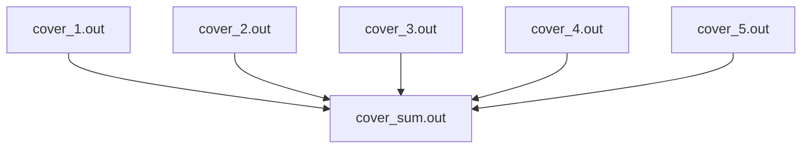

   [](https://codecov.io/gh/cutecutecat/go-cover-merge)


# go-cover-merge

📖go-cover-merge is an Action used to merge several `golang` coverage files generated by:

```
go test -coverprofile
```

It will do something like:



🌞Thanks to @wadey and his project [gocovmerge](https://github.com/wadey/gocovmerge)

# Usage

```yaml
- uses: cutecutecat/go-cover-merge@v1
  with:
    # Input dir containing coverage files(.out) to be merged.
    input_dir: ''

    # Output file coverage file(.out) of merged files.
    # Default: coverage_sum.out
    output_file: ''
```

See [action.yml](action.yml)

# Examples

You should indicate `input_dir` for merged coverage files. `go-cover-merge` will pick all files end with `.out` in this directory.

⚠︎Caution: We recommend there is nothing except files which want to be merged at `input_dir`.

```yaml
- uses: cutecutecat/go-cover-merge@v1
  with:
    input_dir: test
    output_file: ./coverage_sum.out
```

If you don't indicate `output_file`, it will be `coverage_sum.out`  as default at current directory.

```yaml
- uses: cutecutecat/go-cover-merge@v1
  with:
    input_dir: test
```